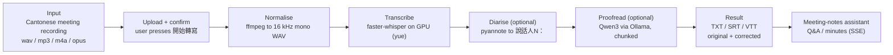
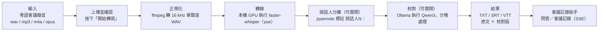

# Cantonese Speech-to-Text

**[English](#cantonese-speech-to-text)** · **[繁體中文](#粵語語音轉文字)**

Local Cantonese transcription pipeline: **faster-whisper (GPU)** + **speaker
diarization (pyannote)** + **local LLM proofreading / meeting-notes assistant
(Ollama)**.

> Everything runs on your own machine — audio is never sent to any cloud service.

---

## Features

- **Upload, then press 「開始轉寫」 (Start)** — nothing runs until you confirm it,
  and you can **abort** at any time; work already completed is kept
- Live per-segment output with progress and ETA; download **TXT / SRT / VTT**
  (`medium` or `large-v3`)
- **Qwen3 proofreading** (optional): corrects only, never summarizes; preserves
  Cantonese colloquialisms, English loanwords and full-width punctuation
- **Speaker diarization** (optional, needs a HuggingFace token): original and
  proofread text side by side, subtitles labelled `說話人N：`
- **Meeting-notes assistant** (chatbox): ask questions about the transcript you
  are viewing, or generate meeting minutes (SSE streaming)
## 2. Project pipeline

**End-to-end path.** Input: a recorded Cantonese meeting containing one or more speakers. Processing: the upload is staged until the user presses 「開始轉寫」, then audio is normalised to 16 kHz mono WAV; faster-whisper transcribes it on the local GPU; pyannote optionally labels who spoke when; Qwen3 optionally corrects the text without summarising it. Output: a timestamped transcript with speaker-prefixed lines, downloadable as TXT, SRT or VTT, plus a chatbox that answers questions about it. The team builds one offline, single-machine web app for that path — not real-time captioning, translation, or a cloud service.



### request → method → result

| Request | Method | Result |
| --- | --- | --- |
| press 「開始轉寫」 after upload | `POST /api/transcribe` — nothing runs before confirmation | job id + progress |
| audio in any container | ffmpeg → 16 kHz mono WAV | audio pyannote can read |
| normalised audio | faster-whisper on the local GPU (`medium` / `large-v3`) | timestamped Cantonese segments |
| segments + audio *(optional)* | pyannote speaker diarization | `說話人N：` prefixes |
| transcript *(optional)* | Qwen3 via Ollama, chunked | corrected text — never a summary |
| finished job | `GET /api/download/<job_id>/<fmt>` | TXT / SRT / VTT |
| question about the transcript *(optional)* | Ollama, SSE stream | answer or meeting minutes |

**What the team will actually build:** one small offline web app that turns a single Cantonese meeting recording into a speaker-labelled, downloadable transcript on one machine. Not real-time captioning, not translation, not a cloud service.

## Requirements

| Item | Notes |
| --- | --- |
| Windows 11 | Tested (Linux/macOS should work in principle, but the FFmpeg/DLL handling is Windows-specific) |
| Python 3.14 | This project uses `.venv` (**mandatory** — see “Gotchas”) |
| NVIDIA GPU | Tested on RTX 4060 Laptop 8 GB + CUDA 12.8 |
| FFmpeg | **shared** build (step 4) **and** the `ffmpeg` command on PATH |
| Ollama | 0.33+, with `ollama pull qwen3:8b` |
| HuggingFace | account + read token (for diarization) |

## Installation

**1. Create the virtual environment**

```bash
python -m venv .venv
.venv/Scripts/python.exe -m pip install -U pip
```

**2. Install the CUDA build of PyTorch first**

```bash
.venv/Scripts/pip.exe install torch torchaudio --index-url https://download.pytorch.org/whl/cu128
```

**3. Install the remaining packages**

```bash
.venv/Scripts/pip.exe install -r requirements.txt
```

**4. FFmpeg shared build** (pyannote 4.x decodes audio through torchcodec, which
needs the DLLs)

1. Download `ffmpeg-master-latest-win64-gpl-shared.zip` from
   <https://github.com/BtbN/FFmpeg-Builds/releases>
2. Extract it and put the whole `ffmpeg-master-latest-win64-gpl-shared` folder
   into `ffmpeg-shared/` in the project root
   (i.e. `ffmpeg-shared/ffmpeg-master-latest-win64-gpl-shared/bin/*.dll`)
3. Add that same `bin` folder to your system PATH so `_to_wav16k()` can call the
   `ffmpeg` command

> `ffmpeg-shared/` is 179 MB and is listed in `.gitignore` — it is not part of
> the repo.

**5. Create `config.json`**

```bash
cp config.example.json config.json
```

Open `config.json` and fill in your HuggingFace token:

| Field | Description |
| --- | --- |
| `hf_token` | Required (for diarization). The `HF_TOKEN` environment variable also works |
| `ollama_url` | Defaults to `http://127.0.0.1:11434` |
| `proofread_model` / `chat_model` | Default `qwen3:8b` |
| `chat_num_ctx` / `chat_num_predict` | Default `16384` / `2048` |

> ⚠️ `config.json` is in `.gitignore` — do **not** commit this file.

**6. Accept the HuggingFace model licences** (click “Agree” while signed in to
the same account)

- `pyannote/speaker-diarization-3.1`
- `pyannote/segmentation-3.0`
- `pyannote/wespeaker-voxceleb-resnet34-LM`
- `pyannote/speaker-diarization-community-1`

**7. Ollama**

```bash
ollama pull qwen3:8b
```

## Running

```bash
start_server.bat        # Windows: clears any stale process on port 5000, then opens the browser
# or
.venv/Scripts/python.exe app.py
```

Open <http://127.0.0.1:5000>.


## Project layout

```
app.py                     Flask server, job management, API
engine.py                  WhisperEngine (transcribe / proofread / diarize / chat_stream)
templates/index.html       single-page UI
static/app.js              frontend logic (polling, SSE, downloads)
static/style.css           Apple-style stylesheet
config.example.json        config template (copy to config.json)
start_server.bat           Windows launch script
e2e_chat.mjs               end-to-end test via headless Chrome (CDP)
test_chatformat.mjs        frontend formatting unit test
```

---

# 粵語語音轉文字

本機端運作的粵語轉錄系統：**faster-whisper（GPU）** ＋ **說話人分離（pyannote）** ＋ **本機 LLM 校對／會議記錄助手（Ollama）**。

> 所有運算皆在使用者本機執行，音訊不會傳送至任何雲端服務。

---

## 功能

- **上傳後需按下「開始轉寫」才會執行**，不會自動開始；執行期間可隨時**中止**，已完成的部分會保留
- 逐段即時顯示結果，並提供進度與預估剩餘時間；可下載 **TXT / SRT / VTT**（模型可選 `medium` 或 `large-v3`）
- **Qwen3 校對（可關閉）**：僅進行校正，不進行摘要；保留粵語口語、英文借詞與全形標點
- **說話人分離（可關閉，需 HuggingFace token）**：原文與校對版並排顯示，字幕標註為 `說話人N：`
- **會議記錄助手**（對話框）：可針對目前檢視的逐字稿提問，或產生會議記錄（SSE 串流）
## 2. 專案流程

**端到端流程。** 輸入：一段包含一位或多位講者的粵語會議錄音。處理：上傳後先暫存，待使用者按下「開始轉寫」才開始；音訊先正規化為 16 kHz 單聲道 WAV，再由 faster-whisper 於本機 GPU 轉錄；pyannote 可選地標註發言者；Qwen3 可選地校正文字，但不進行摘要。輸出：行首標註發言者並附時間戳的逐字稿，可下載為 TXT、SRT 或 VTT，另附可針對逐字稿提問的對話框。團隊實際建置的是一套離線、單機運作的網頁應用 —— 而非即時字幕、翻譯或雲端服務。



### 請求 → 方法 → 結果

| 請求 | 方法 | 結果 |
| --- | --- | --- |
| 上傳後按下「開始轉寫」 | `POST /api/transcribe`，未經確認不會執行 | 工作編號 ＋ 進度 |
| 任意容器格式的音訊 | ffmpeg → 16 kHz 單聲道 WAV | 可供後續處理的音訊 |
| 正規化後的音訊 | 本機 GPU 執行 faster-whisper（`medium` / `large-v3`） | 附時間戳的粵語分段 |
| 分段 ＋ 音訊（可關閉） | pyannote 說話人分離 | `說話人N：` 標註 |
| 逐字稿（可關閉） | Ollama 執行 Qwen3，分塊處理 | 校正後文字 —— 絕不摘要 |
| 已完成的工作 | `GET /api/download/<job_id>/<fmt>` | TXT / SRT / VTT |
| 針對逐字稿的提問（可關閉） | Ollama，SSE 串流 | 答案或會議記錄 |

**團隊實際建置的內容：** 一套小型、離線的網頁應用，於單一機器上將一段粵語會議錄音轉為附發言者標註、可下載的逐字稿。並非即時字幕、並非翻譯、並非雲端服務。

## 環境需求

| 項目 | 說明 |
| --- | --- |
| Windows 11 | 已測試（理論上 Linux／macOS 亦可，但 FFmpeg 與 DLL 的處理方式為 Windows 專用）|
| Python 3.14 | 本專案使用 `.venv`（**必須**）|
| NVIDIA GPU | 已於 RTX 4060 Laptop 8 GB ＋ CUDA 12.8 測試 |
| FFmpeg | **shared** 版本（見步驟 4），且 `ffmpeg` 指令需在 PATH 中 |
| Ollama | 0.33 以上，並執行 `ollama pull qwen3:8b` |
| HuggingFace | 帳號與 read token（說話人分離所需）|

## 安裝

**1. 建立虛擬環境**

```bash
python -m venv .venv
.venv/Scripts/python.exe -m pip install -U pip
```

**2. 先安裝 CUDA 版 PyTorch**

```bash
.venv/Scripts/pip.exe install torch torchaudio --index-url https://download.pytorch.org/whl/cu128
```

**3. 安裝其餘套件**

```bash
.venv/Scripts/pip.exe install -r requirements.txt
```

**4. 下載 FFmpeg shared 版本**（pyannote 4.x 透過 torchcodec 解碼音訊，需要這些 DLL）

1. 自 <https://github.com/BtbN/FFmpeg-Builds/releases> 下載 `ffmpeg-master-latest-win64-gpl-shared.zip`
2. 解壓後，將整個 `ffmpeg-master-latest-win64-gpl-shared` 資料夾放入專案根目錄的 `ffmpeg-shared/`（即 `ffmpeg-shared/ffmpeg-master-latest-win64-gpl-shared/bin/*.dll`）
3. 將上述 `bin` 資料夾加入系統 PATH，`_to_wav16k()` 才能呼叫 `ffmpeg` 指令

> `ffmpeg-shared/` 約 179 MB，已列入 `.gitignore`，不屬於版本庫內容。

**5. 建立 `config.json`**

```bash
cp config.example.json config.json
```

開啟 `config.json` 並填入 HuggingFace token：

| 欄位 | 說明 |
| --- | --- |
| `hf_token` | 必需（說話人分離用）。亦可改用環境變數 `HF_TOKEN` |
| `ollama_url` | 預設 `http://127.0.0.1:11434` |
| `proofread_model` / `chat_model` | 預設 `qwen3:8b` |
| `chat_num_ctx` / `chat_num_predict` | 預設 `16384` / `2048` |

> ⚠️ `config.json` 已列入 `.gitignore`，請**勿**提交此檔案。

**6. 於 HuggingFace 接受模型授權**（需以同一帳號登入並點選 Agree）

- `pyannote/speaker-diarization-3.1`
- `pyannote/segmentation-3.0`
- `pyannote/wespeaker-voxceleb-resnet34-LM`
- `pyannote/speaker-diarization-community-1`

**7. Ollama**

```bash
ollama pull qwen3:8b
```

## 啟動

```bash
start_server.bat        # Windows：先清除佔用 5000 埠的殘留程序，再開啟瀏覽器
# or
.venv/Scripts/python.exe app.py
```

開啟 <http://127.0.0.1:5000>。

## 專案結構

```
app.py                     Flask 伺服器、工作管理、API
engine.py                  WhisperEngine（transcribe / proofread / diarize / chat_stream）
templates/index.html       單頁介面
static/app.js              前端邏輯（輪詢、SSE、下載）
static/style.css           Apple 風格樣式表
config.example.json        設定範本（複製為 config.json）
start_server.bat           Windows 啟動腳本
e2e_chat.mjs               以 headless Chrome（CDP）執行的端到端測試
test_chatformat.mjs        前端格式化單元測試
```
